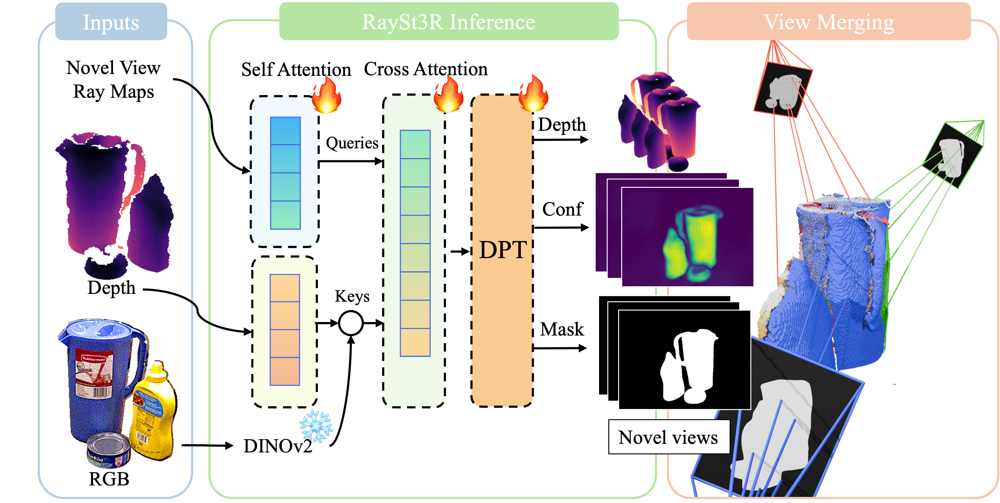

# RaySt3R: Predicting Novel Depth Maps for Zero-Shot Object Completion
<div align="center", documentation will follow later.
<a href="https://arxiv.org/abs/2506.05285"></a>
<a href='https://rayst3r.github.io'></a>

</div>

<div align="center">

</div>

## 📚 Citation
```bibtex
@misc{rayst3r,
          title={RaySt3R: Predicting Novel Depth Maps for Zero-Shot Object Completion}, 
          author={Bardienus P. Duisterhof and Jan Oberst and Bowen Wen and Stan Birchfield and Deva Ramanan and Jeffrey Ichnowski},
          year={2025},
          eprint={2506.05285},
          archivePrefix={arXiv},
          primaryClass={cs.CV},
          url={https://arxiv.org/abs/2506.05285}, 
    }
```
## ✅ TO-DOs

- [x] Inference code
- [x] Local gradio demo
- [x] Docker
- [ ] Huggingface demo
- [ ] Training code
- [ ] Eval code
- [ ] ViT-S, No-DINO and Pointmap models
- [ ] Dataset release 

# ⚙️ Installation

### 🐳 Option 1: Use Prebuilt Docker Image (No Build Required)
Note: Currently supported only for T4 GPUs

1. In the .env file, make the following changes:
```bash
IMAGE_NAME=karthikpullalarevu/rayst3r
TAG=rayst3r_7.5_t4
CUDA_VISIBLE_DEVICES=0 #select according to your configuration
```

2. Run the container (Runs on Port 6000)
```bash
cd rayst3r
docker-compose --env-file .env up -d
docker-compose logs -f --tail 200
```
This pulls and runs the built image directly.

### 🛠️🐳 Option 2: Build Docker image locally
1. Refer to the [CUDA GPU compatibility list](https://developer.nvidia.com/cuda-gpus) for compute capability. (e.g., T4 → 7.5, A100 → 8.0, 4090 → 8.9).
2. In the `.env` file, set the compute capability for your GPU:
```bash
CUDA_ARCH=<compute_capability>
TAG=1.0.0
CUDA_VISIBLE_DEVICES=0 #select according to your configuration
```
3. Build the image:
```bash
cd rayst3r
docker-compose --env-file .env build
```
4. Run the container: (Runs on Port 6000)
```bash
docker-compose --env-file .env up -d
docker-compose logs -f --tail 200
```

### 🛠️ Option 3: Build from Source

```bash
mamba create -n rayst3r python=3.11 cmake=3.14.0
mamba activate rayst3r
mamba install pytorch torchvision pytorch-cuda=12.4 -c pytorch -c nvidia # change to your version of cuda
pip install -r requirements.txt

# compile the cuda kernels for RoPE
cd extensions/curope/
python setup.py build_ext --inplace 
cd ../../
```

# 🚀 Usage

The expected input for RaySt3R is a folder with the following structure:

<pre><code>
📁 data_dir/
├── cam2world.pt       # Camera-to-world transformation (PyTorch tensor), 4x4 - eye(4) if not provided
├── depth.png          # Depth image, uint16 with max 10 meters
├── intrinsics.pt      # Camera intrinsics (PyTorch tensor), 3x3 
├── mask.png           # Binary mask image
└── rgb.png            # RGB image
</code></pre>

Note the depth image needs to be saved in uint16, normalized to a 0-10 meters range. We provide an example directory in `example_scene`.
Run RaySt3R with:

✅ Option 1: Run with Docker API 

1. Ensure Docker is running on port 6000.
2. Your input directory (example_scene/) should be at the same level as the repo and mounted into the container.

🔁 Reconstruct using curl

```bash
curl -X POST http://localhost:6000/reconstruct -F data_dir=example_scene/
```
Optional flags:
```bash
💡 To pass additional arguments, use the -F flag like this:
    
    -F argument_name=value  

    For example:
    -F n_pred_views=5 -F visualize=true
```

Note: During the first run, the models are downloaded. This might take additional time.

✅ Option 2: Run locally
```bash
python3 eval_wrapper/eval.py example_scene/
```
Optional flags (same flags can be used for docker method):
```bash
--n_pred_views # Number of predicted views along each axis in a grid, 5--> 22 views total
--visualize # Spins up a rerun client to visualize predictions and camera posees
--run_octmae # Novel views sampled with the OctMAE parameters (see paper)
--set_conf N # Sets confidence threshold to N 
--filter_all_masks # Use all masks, point gets rejected if in background for a single mask
--tsdf # Fits TSDF to depth maps
```

#### Once executed successfully, a colored point cloud back is saved in the input directory.


# 🧪 Gradio app

We also provide a gradio app, which uses <a href="https://wangrc.site/MoGePage/">MoGe</a> and <a href="https://github.com/danielgatis/rembg">Rembg</a> to generate 3D from a single image.

Launch it with:
```bash
python app.py
```

# 🎛️ Parameter Guide

Certain applications may benefit from different hyper parameters, here we provide guidance on how to select them.

#### 🔁 View Sampling

We sample novel views evenly on a cylindrical equal-area projection of the sphere.
Customize sampling in <a href="eval_wrapper/sample_poses.py">sample_poses.py</a>. Use --n_pred_views to reduce the total number of views, making inference faster and reduce overlap and artifacts.

#### 🟢 Confidence Threshold

You can set the confidence threshold with the --set_conf threshold. As shown in the paper, a higher threshold generally improves accuracy, reduces edge bleeding but also affects completeness.

#### 🧼 RaySt3R Masks

On top of what was presented in the paper, we also provide the option to consider all predicted masks for each point. I.e., for any point, if any of the predicted masks classifies them as background the point gets removed.
In our limited testing this led to cleaner predictions, but it ocasinally carves out crucial parts of geometry.

# 🏋️ Training

The RaySt3R training command is provided in <a href="xps/train_rayst3r.py">train_rayst3r.py</a>, documentation will follow later. 
